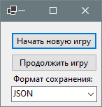
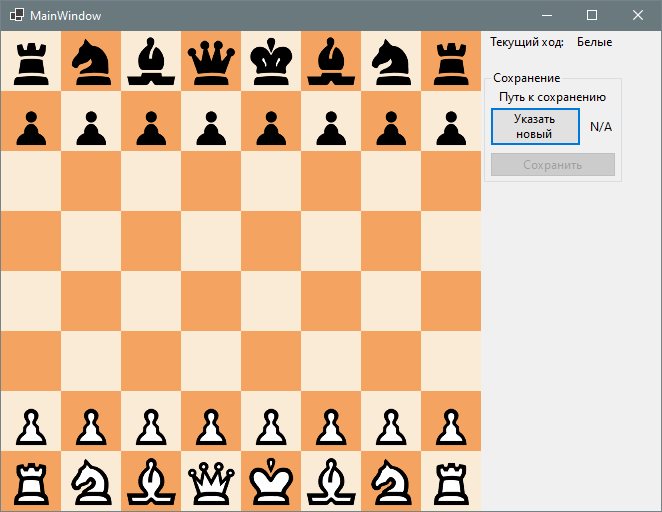
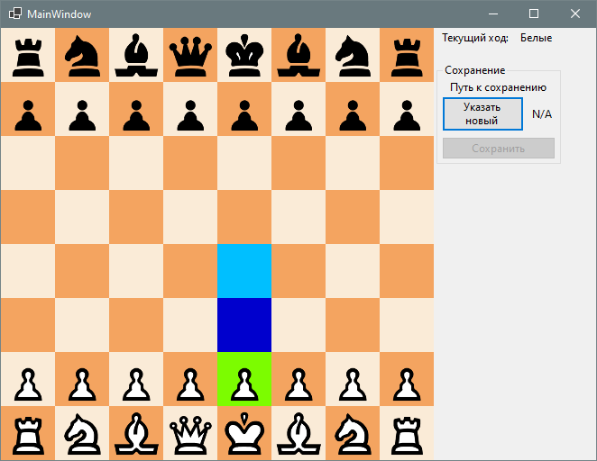
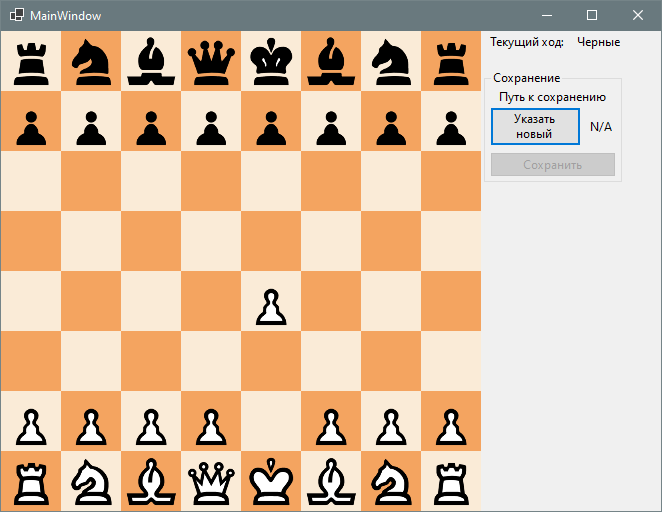
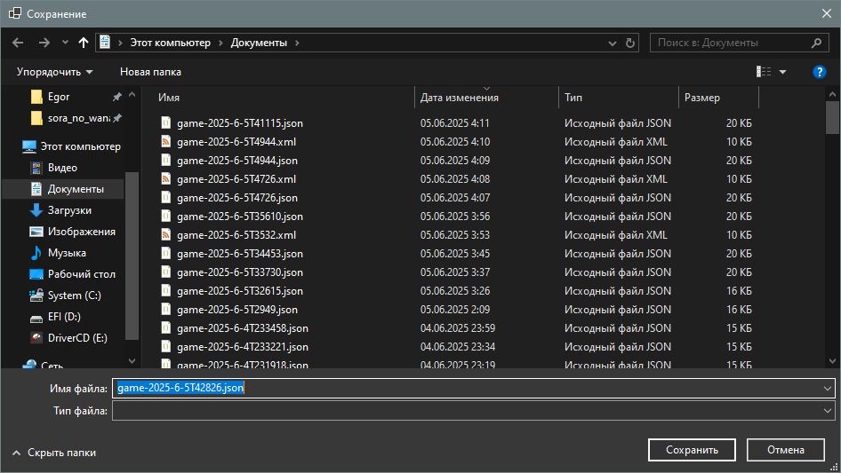
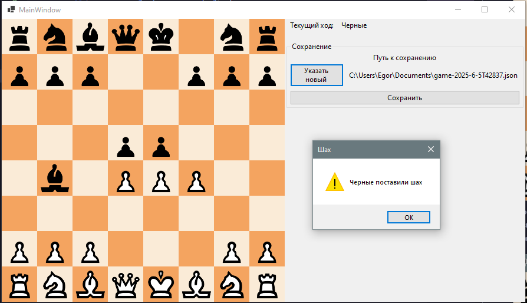

# best-chess [LAB-10]

## Проект: [Chess](https://docs.google.com/document/d/1a0bknP0iAsPaK9j9_EZN_1SW0kzmgegv/edit?tab=t.0#heading=h.h1rrx0gusxdd)
## Выполнили:
- Косачев Егор (БИВТ-24-15)
- Лоскутова Валерия (БИВТ-24-15)

## Запуск решения
Для запуска приложения запустите проект "Gui", при необходимости назначив его в качестве запускаемого

## Использование приложения
После запуска приложения откроется небольшое окно главного меню \

- "Начать новую игру" - начать новую партию со стандартной расстановки ходом белых фигур
- "Продолжить игру" - загрузить файл сохранения и продолжить игру с хода последнего игрока
- "Формат сохранения" - выбор формата сохранения данных игры (`json`/`xml`). Если начать новую игру - она будет автоматически сохранятся в этом формате. Если продолжить игру - ее формат будет изменен на указанный

### Новая игра
 \
В главном окне можно увидеть игровое поле с фигурами, цвет фигур текущего игрока, и информацию о сохранении.

 \
Чтобы выбрать фигуру нажмите по ней левой кнопкой мыши. Фигура будет подсвечена зеленым, а возможные ходы - синим. Вы можете выделить другую фигуру, нажав по ней, или снять выделение, нажав по выделенной фигуре

 \
Чтобы сделать ход кликните по одному из подсвеченых полей доски, фигура переместится на это поле.

 \
Чтобы впервые сохранить игру - нажмите по кнопке "Указать новый [путь к сохранению]". После этого откроется стандартный диалог с выбором места сохранения и имени файла. \
Также эту кнопку можно использовать, если вам необходимо сохранить партию в новом файле. \
После того как вы выберете файл для сохранения, станет доступна кнопка "Сохранить", позволяющая быстро сохранить текущий прогресс партии.\
При выходе из приложения игра будет сохранена автоматически. Если не был выбран файл сохранения - появится соответствующее диалоговое окно

### Загрузка сохраненной партии

При нажатии на кнопку "Продолжить игру" откроется системный диалог выбора файла. Выберите необходимый файл сохранения и откройте его. \
Если файл поврежден, или по каким-то причинам не получается загрузить сохранение - вы увидите сообщение об ошибке \
После загрузки сохранения игра продолжится с хода последнего игрока.

### Сообщения о исходе партии

Когда один из игроков ставит шах (или мат), на экране появляется соответствующее сообщение. Также предусмотрены сообщения о других моментах игры:
- Шах (король может быть атакован следующим ходом, но атаки можно избежать)
- Шах и мат (король может быть атакован следующим ходом, но нет ходов, которые могли бы его спасти)
- Пат (у игроков нет легальных ходов)
- Ничья (при троекратном повторении позиций игроками)